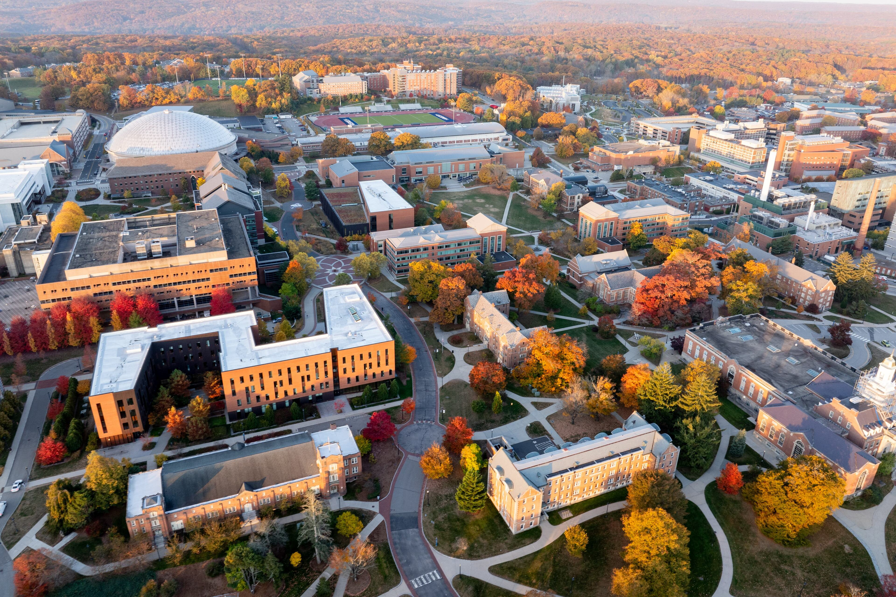

> "Embrace light. Admire it. Love it. But above all, know light." — George Eastman

I am looking for motivated Ph.D. students and postdocs to join my research group. If you are interested in working with me, please feel free to reach out at yuyang.wang [at] uconn [dot] edu.
{:.note title="📢 Looking for Students"}

{:.lead width="3840" height="2560" loading="lazy"}

I am an Assistant Professor in Electrical and Computer Engineering at the University of Connecticut. I design **large-scale integrated photonic systems** to transform future computing paradigms. Addressing communication bottlenecks in AI/machine learning applications through embedded photonic I/O and heterogeneous integration, I aim to redefine chip-to-chip connectivity with unparalleled density and novel functionalities beyond data communication.

Prior to joining UConn, I was a Postdoctoral Research Scientist in the [Lightwave Research Laboratory](https://lightwave.ee.columbia.edu) at Columbia University in the City of New York, supervised by [Prof. Keren Bergman](https://lightwave.ee.columbia.edu/bergman).

I obtained my Ph.D. degree in Electrical and Computer Engineering from the University of California, Santa Barbara, in 2021, co-advised by [Prof. Kwang-Ting Cheng](https://seng.hkust.edu.hk/about/people/faculty/tim-kwang-ting-cheng) and [Prof. John E. Bowers](https://engineering.ucsb.edu/people/john-bowers). I earned my B.Eng. degree in Electronic Engineering from Tsinghua University, Beijing, China, in 2015.

My full CV can be found [here](/assets/files/cv_yw.pdf).
{:.note title="📎 Curriculum Vitae"}

<!-- ## Research Highlights -->

## Recent Publications



## Latest News

<!--posts-->
